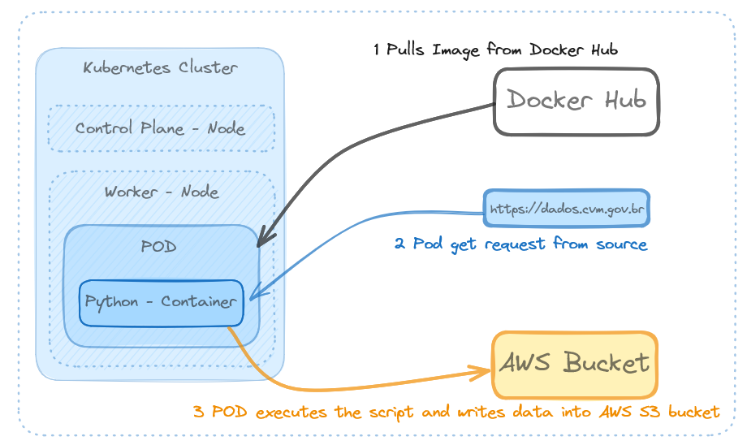
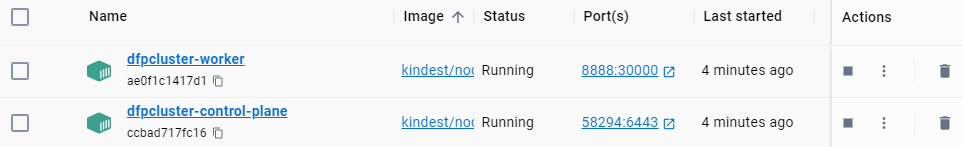
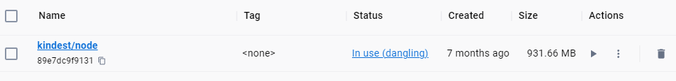
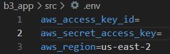
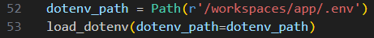
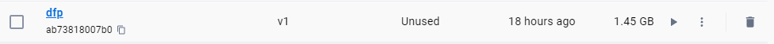
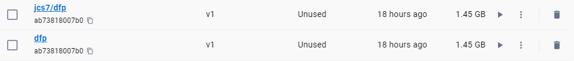
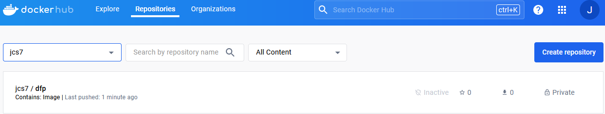

# About the project
This repository keeps a Data Engineering project that aims to gather data from Braziian economic landscape. Initially, most of data is about companies which are listed on B3 (Brasil, Bolsa, Balcão).

# About the requirements
For performing this project you will need:
* KIND (Basic only for creating a cluster)
* Docker (Basic for understand the cluster behavior and maybe debugging it sometimes)
* Kubectl (Basic for deployment and debugging)
* AWS account (IAM role, Security group, AWS cli, Credentials)
* Python (Modules, Classes, Functions)
* Airflow

# Project outline
The project consists of collecting data using python applications and writting it on S3 **datalake**, then making needed **data cleaning** and **tranformations**. Once data is available on datalake, it is transformed into a **Data Lake House** by using **Delta** and **Pyspark**. The whole enviroment will be based on **Docker** containers orchestrated by **kubernetes operators** in **Airflow**.

# Project Status   
## Phase 1 Ingestion to Datalake   

* Ingestion Script:      Done
* Cluster Config:        Done
* Python Docker Image:   Done
* Ingestion Deployment:  Done   
## Phase 2 Datalakehouse   
* Pyspark Image:         Pending
* Data Lake House:       Pending   
## Phase 3 Airflow orchestration   
* Pyspark Image:         Pending
* Data Lake House:       Pending   
## Phase 4 SODA Data Quality   
* Implementing:          Pending   
## Phase 5 AWS RDS   
* Create DB:             Pending   
* Modeling it:           Pending   
## Phase 6 AWS EKS   
* Replicate local cluster on EKS: Pending   

## Settings
The first thing you need is a local Kubernetes Cluster, for this project KIND was used for this task. KIND is a cluster based on Docker containers, so it is crucial that you have KIND and Docker Desktop installed on your machine.
KIND uses YAML files to build the cluster and you can take a look at the b3_app\kind_b3.yaml to get familiarized with the required key:value pairs for the cluster configuration.

## Creating a new cluster on KIND
Make sure you are in b3_app folder.   
Run: 
* kind create cluster --name dfpcluster --config kind_b3.yaml   
***(As a result you ll have two new containers running on your Docker, based on a kind image.)***   
After doing that, you'll see the following on your Docker Desktop  
**Control plane and Worker Containers.**

**KIND image.**

## Setting up AWS credentials   
You'll need to type your credentials on b3_app\src\.env right after the "=" sign:   
   
If you use a different region, adjust the region as well.   

## Understanding the src folder structure   
The src folder contains the whole script that performs the extracting from sources and writting into Datalake. The objects.py has the classes and functions that are used for it.
The DFPgov is the file which calls functions from objects.py in order to properly do the ETL job.   
In the objects.py there is a variable called dotenv_path that you might be aware of. This variable indicates the path to .env file you recent adjust. Note that the path indicates /workspaces/app/.env as it will be the right path within the container. If you try unning that locally, you can change the path for the .env file.

## Building and pushing a DOCKER image to DockerHub
Your recent created Kubernetes cluster needs that you have your images available on a container registry. The following steps are for build your image locally and then push into Docker Hub:    
***(It is required to have a account on Docker)***

* docker build -t dfp:v1 .

* docker login
* docker tag dfp:v1 jcs7/dfp:v1 

* docker push jcs7/dfp:v1  

***(It is gonna push as public, make it private, as soon as it is done by clicking on settings.)***

## Adding a secret on cluster to access your DockerHub image
As this project access AWS bucket, you must be sure of working only with private repositories in order to keep your credentials from unallowed accessing issues.

* kubectl create secret docker-registry regcred --docker-server="https://index.docker.io/v1/" --docker-username="" --docker-password="" --docker-email=""

The above command will create a new token named as regcred. This token is mentioned on your deployment.yaml file.

## Deploying your app
* kubectl apply -f python-deploy.yaml
* kubectl get pods ***You expect to see status running. It may take few minutes.***
* If you have CrashLoopBackoff status, it is probally because your Docker ran out of memory, just restart your system and repeat those steps if you need. In case of you need troubleshotting it, the following commands may be handy:
kubectl get pods ***To get the pod name***
kubectl describe <pod name>
